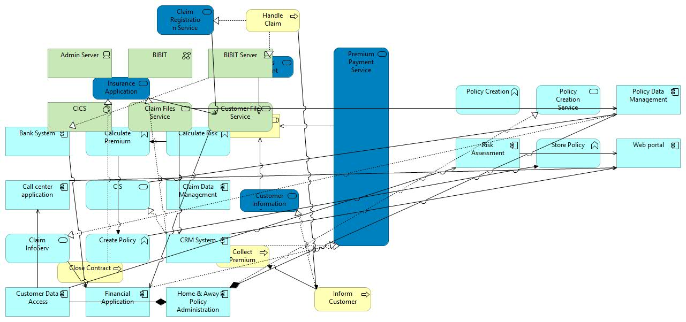
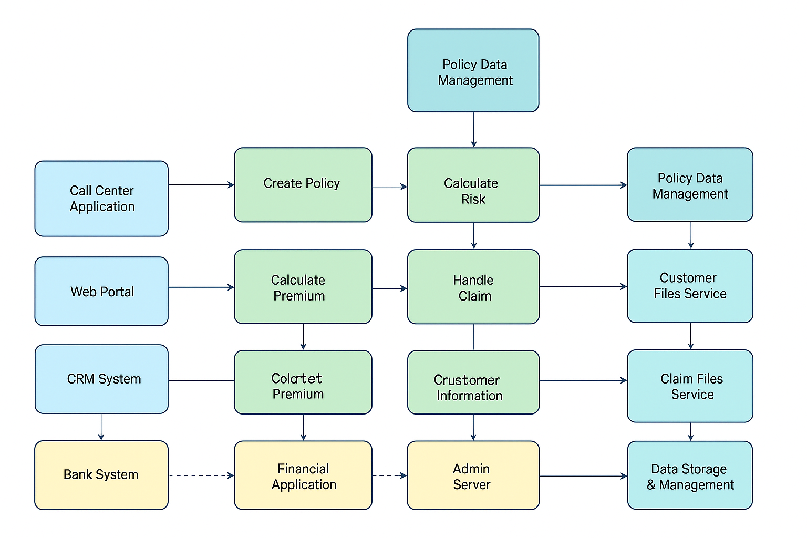

The typical working day of an IT Enterprise Architect is dedicated to mapping the IT landscape of the organization. Very large organizations employ Enterprise Architects, and the larger the organization, the higher is the need for a comprehensive overview of the system landscape. Data flows need to be shown, who uses which system for which purpose, and how are these systems structured. 
When an organization newly starts establishing the Enterprise Architecture practice, they quickly discover that commercial tools are quite pricy and that staff needs time and training to use them. Worse, many tools violate the very principle which often was the actual driver for setting up the architecture practice itself: Interoperability. 
We actually found a nice solution for the beginning: ArchiMate is the standard notation for Enterprise Architecture, it comes along with its own metamodel, there is an awesome open source modelling tool, and has a very large community, and best of all: There is a standard file format that permits exchanging models between at least some tools. The downsides should not be kept secret as well: My collegues are in deep disgrace for "my" choice of colorings: ArchiMate comes with semantics for colors and these colors seem to resemble those used by the CGA computer games from the 80s. The plentitude of entity types provided by the ArchiMate metamodel is so overwhelming, that one needs to put very tight restrictions on what to put on the map. Usually, the maps are hardly unterstandable by management or anyone who has never taken a class on ArchiMate.

So back to my typical working day: As no single person knows it all, and documentation is not always available, I conduct interviews with the folks operating the specialized software systems and document what they say directly on an Archi view. I regularly end up with a view full of stuff, and sometimes I need a full day to find a meaningful layout, thinking at least a meaningful ordering of the entities would make up for the colors, icons and arrows. 
But in terms of me understanding our IT landscape and keeping an enterprise repository, this layout work is not contributing a lot.
Thus, an algorithm or any kind of automation is needed in order to save time.

A short overview of auto layouting options for ArchiMate follows:

1. [https://declanbright.com/archimate-graph-explorer/] Declan Bright's ArchiMate Graph Explorer uses a force directed graph, with weights assigned to nodes corresponding to their degree of connections. This wonderful piece of software has two shortcomings: First of all, the output/ordering can not be exported back to Archi. And second, the loaded ArchiMate file cannot exceed 10 megabytes in size because it gets stored in localStorage. Thats very easy to workaround, I just store the xml text of that ArchiMate file in a window.-Variable and now the graph explorers shows my 25 megabyte ArchiMate file. I will share that here; but I guess anybody who may be using it could think it up on their own.
2. [https://github.com/ThomasRohde/archi-scripts] There are some scripts that apply DAGRE layout to views. DAGRE is fine for trees: Organigrams for tree-like capability maps, for example. The things I have on my maps are not a tree at all.

For testing purposes, I used some stuff from the ArchiSurance file and made a exaggeratedly messy map from that:

I asked ChatGPT to make in better, and the output was:
“generated with the assistance of OpenAI’s GPT-5 model.”

 /*
 *  This is an jArchi-Script to be executed with GraalJSScriptEngine.
 *
 *  The program intents to organize your currently selected Archi view following some rules.
 *  The rules are evaluated in the fashion of a fitness function of a genetic algorithm.
 *   
 *  An individuum of the population represents a view, that is the location and size of all elements on the view.
 *  
 *  A big confound is the nesting of elements, which is currently not accessible via jArchi scripting.
 *  Further program versions may address the nestings by using the Java API.
 *  
# jarchi-ga-organizeView
Optimize Archimate view layout using a genetic algorithm
