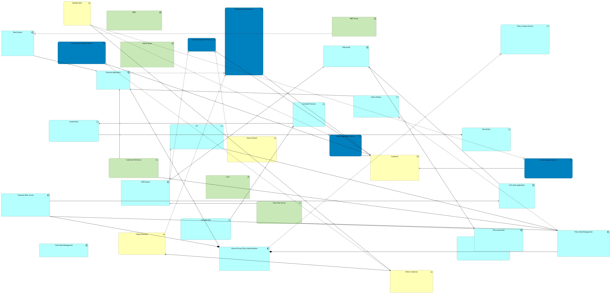

# Darwin shifting the Boxes

**How a Genetic Algorithm may auto-layout ArchiMate views, written as a jArchi-Script. You need the jArchi-Plugin for Archi in order to execute the script. It has no further dependencies.**

The typical working day of an IT Enterprise Architect is dedicated to mapping the IT landscape of the organization. Very large organizations employ Enterprise Architects, and the larger the organization, the higher is the need for a comprehensive overview of the system landscape. Data flows need to be shown, who uses which system for which purpose, and how are these systems structured. 
When an organization newly starts establishing the Enterprise Architecture practice, they quickly discover that commercial tools are quite pricy and that staff needs time and training to use them. Worse, many tools violate the very principle which often was the actual driver for setting up the architecture practice itself: Interoperability. 
We actually found a nice solution for the beginning: ArchiMate is the standard notation for Enterprise Architecture, it comes along with its own metamodel, there is an awesome open source modelling tool, and has a very large community, and best of all: There is a standard file format that permits exchanging models between at least some tools. The downsides should not be kept secret as well: My collegues are in deep disgrace for "my" choice of colorings: ArchiMate comes with semantics for colors and these colors seem to resemble those used by the CGA computer games from the 80s. The plentitude of entity types provided by the ArchiMate metamodel is so overwhelming, that one needs to put very tight restrictions on what to put on the map. Usually, the maps are hardly unterstandable by management or anyone who has never taken a class on ArchiMate.

So back to my typical working day: As no single person knows it all, and documentation is not always available, I conduct interviews with the folks operating the specialized software systems and document what they say directly on an Archi view. I regularly end up with a view full of stuff, and sometimes I need a full day to find a meaningful layout, thinking at least a meaningful ordering of the entities would make up for the colors, icons and arrows. 
But in terms of me understanding our IT landscape and keeping an enterprise repository, this layout work is not contributing a lot.
Thus, an algorithm or any kind of automation is needed in order to save time.

A short overview of auto layouting options for ArchiMate follows:

1. [https://declanbright.com/archimate-graph-explorer/] Declan Bright's ArchiMate Graph Explorer uses a force directed graph, with weights assigned to nodes corresponding to their degree of connections. This wonderful piece of software has two shortcomings: First of all, the output/ordering can not be exported back to Archi. And second, the loaded ArchiMate file cannot exceed 10 megabytes in size because it gets stored in localStorage. Thats very easy to workaround, I just store the xml text of that ArchiMate file in a window.-Variable and now the graph explorers shows my 25 megabyte ArchiMate file. I will share that here; but I guess anybody who may be using it could think it up on their own.
2. [https://github.com/ThomasRohde/archi-scripts] There are some scripts that apply DAGRE layout to views. DAGRE is fine for trees: Organigrams, or tree-like capability maps, for example. The things I have on my maps, they form not a tree at all.

For testing purposes, I used some stuff from the ArchiSurance file and made an exaggeratedly messy map from that:

I asked ChatGPT to make it better, and the output had very many missing edges, many missing nodes, some spelling mistakes; It also didn't take into account the different type of edges. In ArchiMate they represent things like: data flow; composition; specialization, etc.. The following image was generated by the OpenAI’s GPT-5 model. The prompt was "can you please improve the layout of my archimate view?" and when it asked back what to focus on, I replied: "data flow please; generate new improved image".

So as of today, LLMs are not fit for that task. How would they, given that here we deal with boxes, not words. 
And frankly I just wouldn't know what an algorithm would like like, that simply improves those views generically. 
But could I describe by what attributes I would recognize a better version of that view? That way, the layouting becomes a multidimensional optimization problem; most likely some kind of strange relative of the NP-hard Traveling Salesman Problem. So whats the solution to NP-hard problems? Yeah, quantum computing! And for the time until I get my quantum computer, a similar mechanism needs to suffice, something thats not just indefinetly guessing and trying out all solutions, but comes up with potentially good candidates on its own. That leads us to Genetic Algorithms, that I once got taught by the wonderful professor Ernesto Staffetti [https://tsc.urjc.es/~staffetti/] at URJC in 2006. That was a long time ago, but still Genetic Algorithms are a beautiful way of looking at problems by shifting our focus to what actually makes up good solutions.

The magic of the Genetic Algorithms lies in these two essential parts:
In solution space, consider there may be a large number of randomly generated more or less nice solutions for your problem. How do you combine them in such a way so that the good attributes of both parents get transfered to their ancestor? And second, a fitness function, that serves for eliminating the bad solutions that will lead nowhere. After eliminating the bad ideas, we randomly generate new ones; it may be smart to generate them in a specific way, but actually this is the point where random creativity is needed in order to broaden the solution space.

In my algorithm I posted here, I solved none of that problems. And please don't laugh at the 2005-Javascript-coding-style. And don't get mad at my careless interpretation of Genetic Algorithms and that there is no normalization for any value ranges. This is just a Proof of Concept and it may benefit from ideas in terms of fitness and recombination. 

What it does, after 10 minutes calculation time on my 8 years old laptop, that means: 100 generations of 800-1600 solutions, is this:

Obviously, there is a lot of space for improvement here.

Some of the rules for fitness are:
1. Inspired by Gregor Hohpe's great book "The Software Architect Elevator: Redefining the Architect's Role in the Digital Enterprise", the rule to place those elements in the middle, that have the highest degree of connection. Also make them larger
2. Have some minimum spacing between items
3. Keep an aspect ratio better than 1:4
4. Boxes should **not** overlap, obviously
5. If there is a connection between to boxes, there shouldn't be another box just in the middle between them

Looking at that sketch above: "make short paths shorter" could be a rule.

For recombining two solutions, I implemented 3 random modes:
1. average all box locations and sizes (this probably just moves stuff to the middle, maybe not a good idea)
2. decide if take the value from box1 or box2 (decision per attribut, maybe different within an individual)
3. decide if take the value from box1 or box2 (decision per individual)

For the moment, I'm struggling to come up with more rules; but I am confident they will arise sooner or later.
Thanks for reading.
